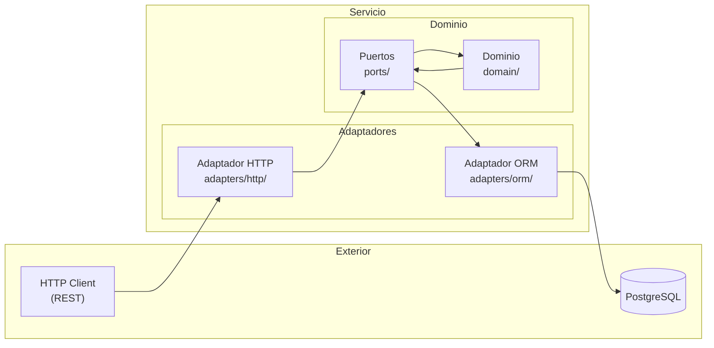
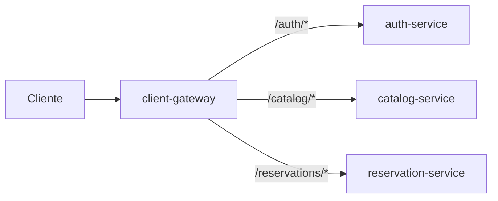
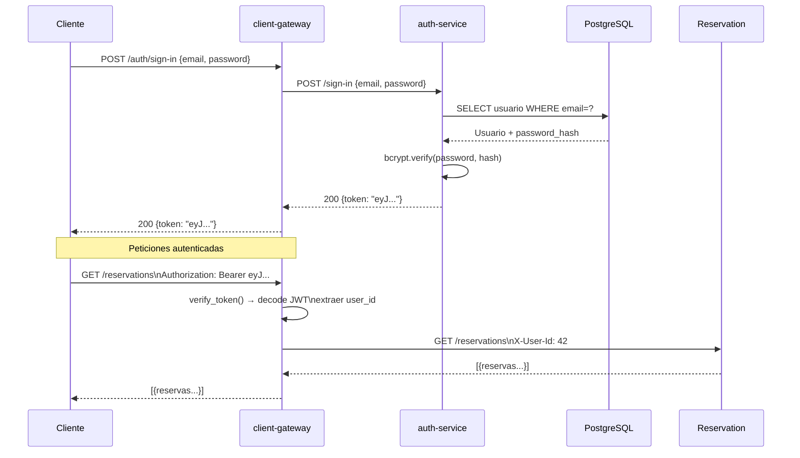
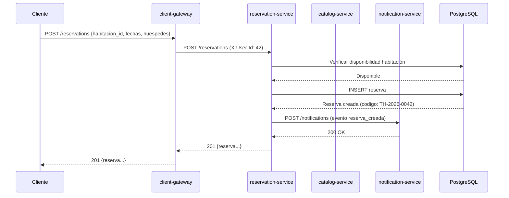
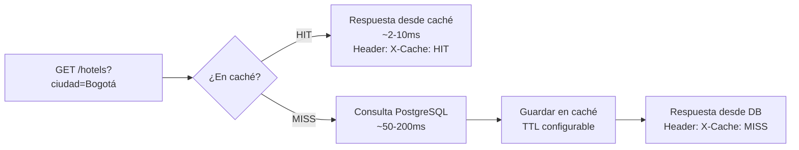
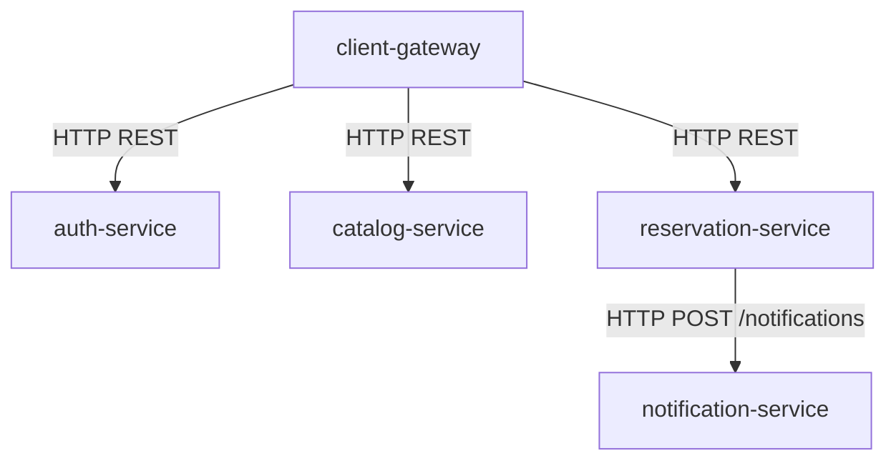

# Arquitectura

## Patrón Arquitectónico: Hexagonal (Ports & Adapters)

Cada microservicio sigue la **arquitectura hexagonal**, que separa la lógica de negocio del dominio de los detalles de infraestructura (HTTP, base de datos, mensajería). Esto permite sustituir los adaptadores sin tocar la lógica central.



### Estructura de directorios por servicio

```
{servicio}/
├── app.py                 # Punto de entrada Flask
├── config.py              # Variables de entorno
├── adapters/
│   ├── http/              # Rutas Flask (entrada)
│   └── orm/               # Modelos SQLAlchemy (salida)
├── domain/                # Entidades y lógica de negocio
├── ports/                 # Interfaces/contratos
└── tests/                 # Pruebas unitarias e integración
```

---

## Microservicios

### client-gateway (Puerto 8000)

Punto de entrada único para todos los clientes. Responsabilidades:

- **Autenticación**: Valida JWT en endpoints protegidos antes de hacer proxy
- **Enrutamiento**: Reenvía peticiones al servicio correspondiente
- **Documentación**: Expone Swagger UI en `/apidocs/`
- **CORS**: Habilita acceso desde frontends Angular



Organización interna con Flask Blueprints:

| Blueprint      | Prefijo         | Descripción                       |
| -------------- | --------------- | --------------------------------- |
| `general`      | `/`             | Health check y estado del sistema |
| `auth`         | `/auth`         | Proxy a auth-service              |
| `catalog`      | `/catalog`      | Proxy a catalog-service           |
| `reservations` | `/reservations` | Proxy a reservation-service       |

### auth-service (Puerto 5000)

Gestiona identidades y sesiones. Genera tokens JWT firmados con `HS256`.

- Registro de usuarios (`cliente` o `hotel`)
- Login / Logout
- Consulta y actualización de perfil

### catalog-service (Puerto 5001)

Gestiona el inventario hotelero.

- CRUD completo de hoteles y habitaciones
- Filtros por ciudad, precio, estrellas, disponibilidad
- Paginación de resultados
- **Caché in-memory** para consultas GET (ver sección Caché)

### reservation-service (Puerto 5002)

Gestiona el ciclo de vida de las reservas.

- Creación y cancelación de reservas
- Consulta de habitaciones ocupadas en un rango de fechas
- Estadísticas del hotel (KPIs): ocupación, ingresos, reservas activas
- Al crear una reserva, notifica al notification-service

### notification-service (Puerto 5004)

Servicio de notificaciones desacoplado. Recibe eventos del reservation-service y procesa el envío de comunicaciones (email, etc.). No es accesible desde el gateway.

---

## Flujo de Autenticación



El header `X-User-Id` es la forma en que el gateway comunica la identidad del usuario autenticado a los servicios internos, sin que estos tengan que validar JWT directamente.

---

## Flujo de Reserva



---

## Sistema de Caché

El **catalog-service** implementa caché in-memory con `Flask-Caching (SimpleCache)` para reducir la latencia en lecturas frecuentes.



| Métrica           | Sin caché | Con caché (HIT) |
| ----------------- | --------- | --------------- |
| Latencia promedio | 50–200 ms | 2–10 ms         |
| Mejora            | —         | ~90–95%         |
| Carga en DB       | Alta      | ~90% reducida   |

La caché se invalida automáticamente al crear, modificar o eliminar un hotel o habitación.

---

## Comunicación Entre Servicios

Todos los servicios se comunican vía **HTTP REST síncrono**. No hay broker de mensajes (excepto el envío de notificaciones que puede ser asíncrono dentro del reservation-service).



Las URLs de los servicios internos se configuran mediante variables de entorno:

| Variable                  | Valor por defecto       |
| ------------------------- | ----------------------- |
| `AUTH_SERVICE_URL`        | `http://localhost:5000` |
| `CATALOG_SERVICE_URL`     | `http://localhost:5001` |
| `RESERVATION_SERVICE_URL` | `http://localhost:5002` |
