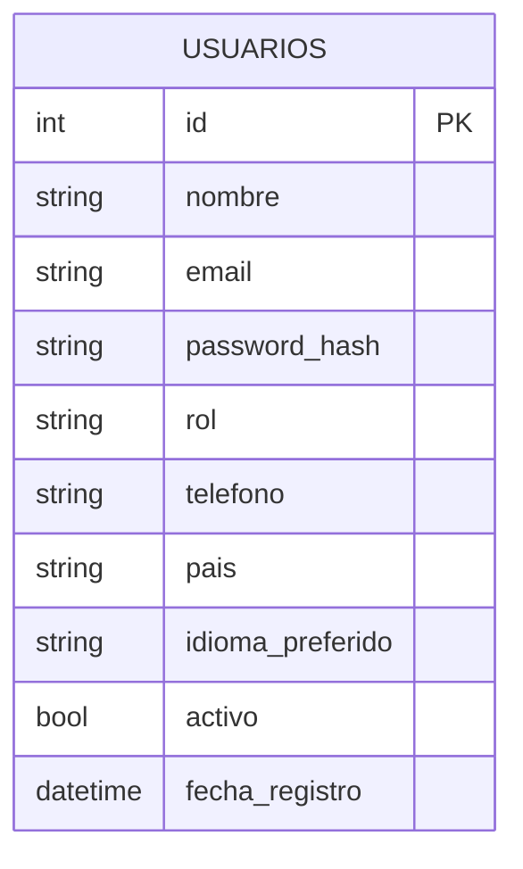
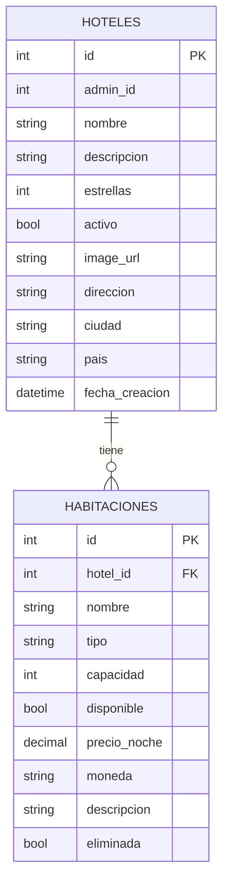
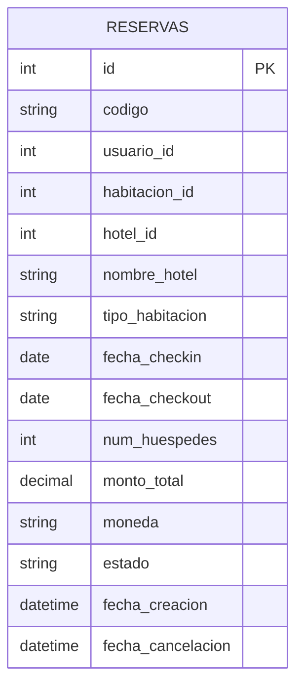

# Base de Datos

TravelHub usa **PostgreSQL 15**. Cada microservicio tiene su propio **schema** dentro de la misma base de datos, lo que garantiza aislamiento lógico sin necesidad de múltiples instancias de base de datos.

| Microservicio        | Schema PostgreSQL             |
| -------------------- | ----------------------------- |
| auth-service         | `public` (schema por defecto) |
| catalog-service      | `public`                      |
| reservation-service  | `reservation`                 |
| notification-service | `notifications`               |

Los modelos se definen con **SQLAlchemy ORM** y las tablas se crean automáticamente al arrancar cada servicio (`Base.metadata.create_all(engine)`).

---

## Schema: Autenticación (`auth-service`)

### Tabla `usuarios`



| Columna            | Tipo             | Descripción                       |
| ------------------ | ---------------- | --------------------------------- |
| `id`               | `INTEGER` PK     | Identificador único               |
| `nombre`           | `VARCHAR`        | Nombre completo                   |
| `email`            | `VARCHAR` UNIQUE | Correo electrónico (único)        |
| `password_hash`    | `VARCHAR`        | Hash bcrypt de la contraseña      |
| `rol`              | `VARCHAR`        | `"cliente"` o `"hotel"`           |
| `telefono`         | `VARCHAR`        | Teléfono de contacto              |
| `pais`             | `VARCHAR`        | País de residencia                |
| `idioma_preferido` | `VARCHAR`        | Código de idioma (`"es"`, `"en"`) |
| `activo`           | `BOOLEAN`        | Si la cuenta está activa          |
| `fecha_registro`   | `TIMESTAMP`      | Fecha de creación de la cuenta    |

---

## Schema: Catálogo (`catalog-service`)

### Relación Hoteles–Habitaciones



### Tabla `hoteles`

| Columna          | Tipo         | Descripción                    |
| ---------------- | ------------ | ------------------------------ |
| `id`             | `INTEGER` PK | Identificador único            |
| `admin_id`       | `INTEGER`    | ID del usuario con rol `hotel` |
| `nombre`         | `VARCHAR`    | Nombre del hotel               |
| `descripcion`    | `TEXT`       | Descripción del hotel          |
| `estrellas`      | `INTEGER`    | Clasificación (1–5)            |
| `activo`         | `BOOLEAN`    | Si el hotel está publicado     |
| `image_url`      | `VARCHAR`    | URL de la imagen principal     |
| `direccion`      | `VARCHAR`    | Dirección física               |
| `ciudad`         | `VARCHAR`    | Ciudad                         |
| `pais`           | `VARCHAR`    | País                           |
| `fecha_creacion` | `TIMESTAMP`  | Fecha de alta                  |

### Tabla `habitaciones`

| Columna        | Tipo                   | Descripción                             |
| -------------- | ---------------------- | --------------------------------------- |
| `id`           | `INTEGER` PK           | Identificador único                     |
| `hotel_id`     | `INTEGER` FK → hoteles | Hotel al que pertenece                  |
| `nombre`       | `VARCHAR`              | Nombre de la habitación                 |
| `tipo`         | `VARCHAR`              | Tipo (`"Simple"`, `"Doble"`, `"Suite"`) |
| `capacidad`    | `INTEGER`              | Número máximo de huéspedes              |
| `disponible`   | `BOOLEAN`              | Si está habilitada para reservas        |
| `precio_noche` | `DECIMAL`              | Precio por noche                        |
| `moneda`       | `VARCHAR`              | Código de moneda (`"COP"`, `"USD"`)     |
| `descripcion`  | `TEXT`                 | Descripción de la habitación            |
| `eliminada`    | `BOOLEAN`              | Soft delete                             |

---

## Schema: Reservas (`reservation-service`)

### Tabla `reservation.reservas`



| Columna             | Tipo             | Descripción                                   |
| ------------------- | ---------------- | --------------------------------------------- |
| `id`                | `INTEGER` PK     | Identificador único                           |
| `codigo`            | `VARCHAR` UNIQUE | Código legible (`TH-2026-0042`)               |
| `usuario_id`        | `INTEGER`        | ID del usuario que reservó                    |
| `habitacion_id`     | `INTEGER`        | ID de la habitación reservada                 |
| `hotel_id`          | `INTEGER`        | ID del hotel                                  |
| `nombre_hotel`      | `VARCHAR`        | Nombre del hotel (desnormalizado)             |
| `tipo_habitacion`   | `VARCHAR`        | Tipo de habitación (desnormalizado)           |
| `fecha_checkin`     | `DATE`           | Fecha de entrada                              |
| `fecha_checkout`    | `DATE`           | Fecha de salida                               |
| `num_huespedes`     | `INTEGER`        | Número de huéspedes                           |
| `monto_total`       | `DECIMAL`        | Costo total calculado                         |
| `moneda`            | `VARCHAR`        | Moneda del monto                              |
| `estado`            | `VARCHAR`        | `"confirmada"`, `"cancelada"`, `"completada"` |
| `fecha_creacion`    | `TIMESTAMP`      | Fecha de creación de la reserva               |
| `fecha_cancelacion` | `TIMESTAMP`      | Fecha de cancelación (nullable)               |

!!! note "Desnormalización intencional"
`nombre_hotel` y `tipo_habitacion` se almacenan desnormalizados en la reserva para garantizar que los datos históricos sean inmutables ante cambios en el catálogo.

---

## Migraciones

Las tablas se crean automáticamente al iniciar cada servicio. Para cambios en producción existe una carpeta `migrations/` con scripts SQL numerados:

```
catalog-service/migrations/
├── 001_add_descripcion_habitaciones.sql
└── 002_add_eliminada_habitaciones.sql

reservation-service/migrations/
└── (pendientes)
```

Los scripts se aplican manualmente contra la base de datos RDS:

```bash
psql -h <RDS_HOST> -U travelhub_user -d travelhub \
  -f catalog-service/migrations/001_add_descripcion_habitaciones.sql
```

---

## Datos de Prueba

El archivo `seed_catalog.sql` carga datos iniciales para desarrollo:

- **100 hoteles** distribuidos en múltiples ciudades
- **1000 habitaciones** con variedad de tipos y precios

```bash
# Con Docker Compose activo
docker exec -i proyecto-final-postgres-1 \
  psql -U travelhub_user -d travelhub < seed_catalog.sql
```
