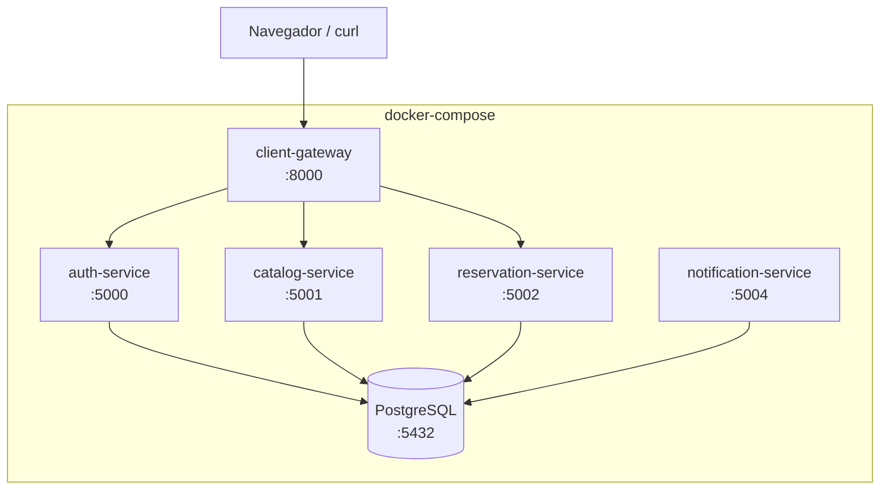
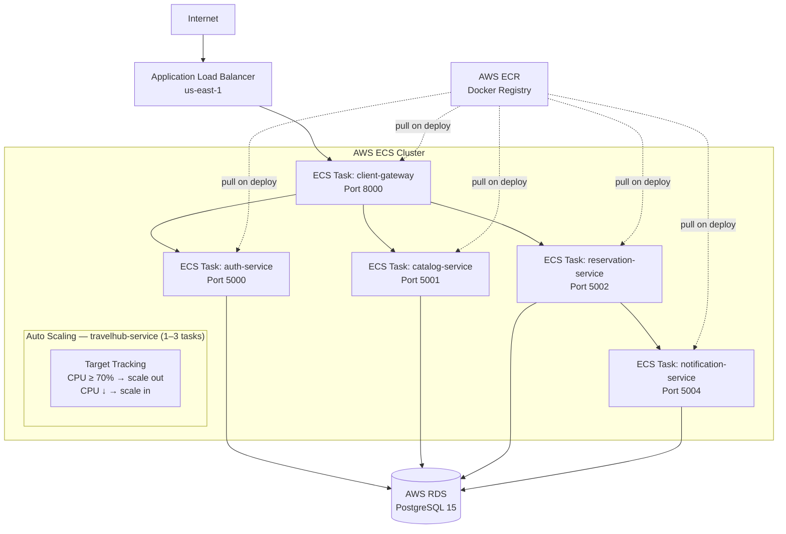
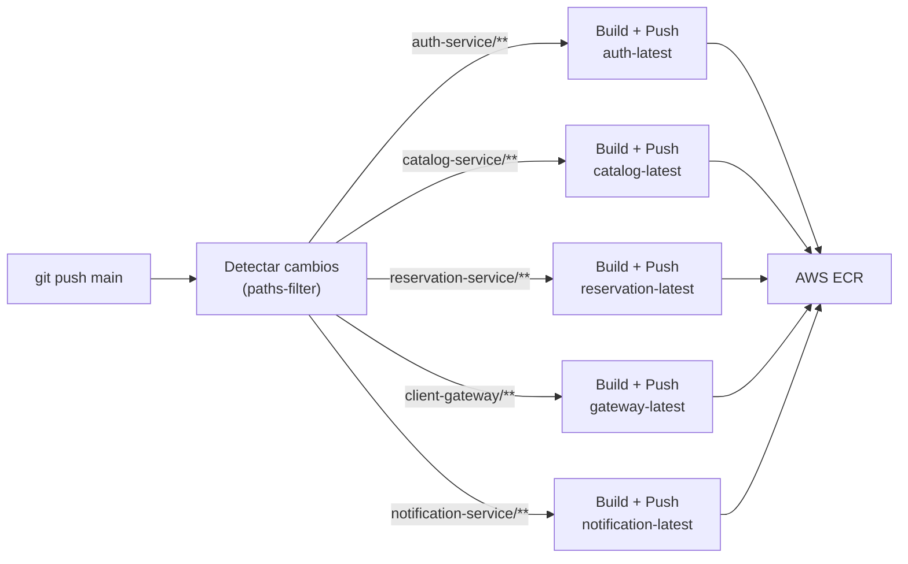

# Despliegue

TravelHub soporta dos modalidades de despliegue: **local con Docker Compose** para desarrollo y **AWS ECS** para producción.

---

## Despliegue Local (Docker Compose)

### Arquitectura local



### Levantar el entorno

```bash
# 1. Construir e iniciar todos los servicios
docker-compose up --build

# 2. (Primera vez) Cargar datos de prueba
docker exec -i proyecto-final-postgres-1 \
  psql -U travelhub_user -d travelhub < seed_catalog.sql

# 3. Verificar
curl http://localhost:8000/health
```

Los servicios arrancan en este orden gracias a `depends_on`: PostgreSQL → servicios backend → gateway.

### Variables de entorno (docker-compose.yml)

| Variable                  | Servicio              | Descripción                          |
| ------------------------- | --------------------- | ------------------------------------ |
| `DATABASE_URL`            | Todos                 | Cadena de conexión a PostgreSQL      |
| `JWT_SECRET`              | auth-service, gateway | Clave para firmar/verificar JWT      |
| `AUTH_SERVICE_URL`        | gateway               | URL interna del auth-service         |
| `CATALOG_SERVICE_URL`     | gateway               | URL interna del catalog-service      |
| `RESERVATION_SERVICE_URL` | gateway               | URL interna del reservation-service  |
| `CACHE_TTL`               | catalog-service       | Tiempo de vida del caché en segundos |

---

## Despliegue en Producción (AWS)

### Infraestructura AWS



| Recurso AWS            | Identificador                                                 |
| ---------------------- | ------------------------------------------------------------- |
| ALB (endpoint público) | `proyecto-final-alb-1238672503.us-east-1.elb.amazonaws.com`   |
| ECR Repository         | `108633434648.dkr.ecr.us-east-1.amazonaws.com/proyecto-final` |
| Región                 | `us-east-1`                                                   |

### Auto Scaling

El servicio ECS (`travelhub-service`) tiene configurada una política de **Target Tracking** para escalar automáticamente según la carga de CPU:

| Parámetro          | Valor                             |
| ------------------ | --------------------------------- |
| Mínimo de tareas   | 1                                 |
| Máximo de tareas   | 3                                 |
| Métrica objetivo   | `ECSServiceAverageCPUUtilization` |
| Umbral             | 70%                               |
| Scale out cooldown | 300 s                             |
| Scale in cooldown  | 300 s                             |

Cuando el uso promedio de CPU supera el 70%, ECS lanza tareas adicionales (hasta 3). Cuando baja, reduce hasta la tarea mínima.

### Tags de imágenes en ECR

Cada servicio tiene su propio tag `latest` en el mismo repositorio:

| Servicio             | Tag ECR               |
| -------------------- | --------------------- |
| auth-service         | `auth-latest`         |
| catalog-service      | `catalog-latest`      |
| reservation-service  | `reservation-latest`  |
| notification-service | `notification-latest` |
| client-gateway       | `gateway-latest`      |

---

## CI/CD con GitHub Actions

El pipeline de integración y despliegue continuo está definido en `.github/workflows/deploy-ecr.yml`.

### Flujo del pipeline



### Optimización: detección de cambios

El pipeline usa `dorny/paths-filter` para **construir solo los servicios modificados**, reduciendo el tiempo de CI significativamente. Si solo se modifica `catalog-service/`, únicamente se construye y publica esa imagen.

### Secrets requeridos en GitHub

| Secret                  | Descripción                                           |
| ----------------------- | ----------------------------------------------------- |
| `AWS_ACCESS_KEY_ID`     | Access Key del usuario IAM `github-actions-travelhub` |
| `AWS_SECRET_ACCESS_KEY` | Secret Key correspondiente                            |

### Ejecución manual

El workflow puede ejecutarse manualmente desde la pestaña **Actions** de GitHub con el trigger `workflow_dispatch`.

---

## Dockerfiles

Cada servicio tiene su propio `Dockerfile` con una estructura similar:

```dockerfile
FROM python:3.11-slim

WORKDIR /app
COPY requirements.txt .
RUN pip install --no-cache-dir -r requirements.txt

COPY . .

EXPOSE <PORT>
CMD ["python", "app.py"]
```

Los servicios no incluyen `venv` en la imagen; las dependencias se instalan directamente en el entorno del contenedor.

---

## Health Checks

El endpoint `/health` del gateway verifica la conectividad con los tres servicios backend:

```bash
curl http://localhost:8000/health
```

```json
{
  "status": "healthy",
  "services": {
    "auth": "ok",
    "catalog": "ok",
    "reservations": "ok"
  }
}
```

Si algún servicio interno no responde en 5 segundos, el health check reporta `"error"` para ese servicio específico.
