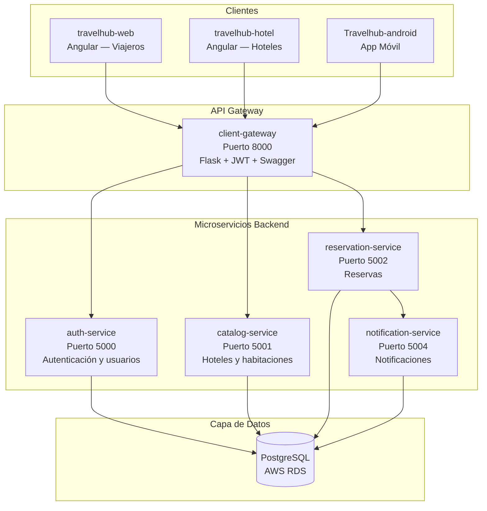

# TravelHub — Plataforma de Reservas de Hoteles

**TravelHub** es una plataforma de reservas hoteleras construida con arquitectura de microservicios. Permite a viajeros buscar hoteles, consultar disponibilidad y hacer reservas en tiempo real, mientras los administradores de hoteles gestionan su inventario de habitaciones y visualizan estadísticas.

---

## Stack Tecnológico

| Componente               | Tecnología               |
| ------------------------ | ------------------------ |
| Backend (microservicios) | Python 3.11, Flask 3.x   |
| Frontend web (clientes)  | Angular 18 + TailwindCSS |
| Frontend web (hoteles)   | Angular 18 + TailwindCSS |
| Aplicación móvil         | Android (Kotlin)         |
| Base de datos            | PostgreSQL 15 (AWS RDS)  |
| Contenedores             | Docker + Docker Compose  |
| Orquestación cloud       | AWS ECS (Fargate)        |
| Registro de imágenes     | AWS ECR                  |
| Balanceo de carga        | AWS ALB                  |
| CI/CD                    | GitHub Actions           |
| Autenticación            | JWT (PyJWT)              |
| Documentación API        | Swagger UI (Flasgger)    |

---

## Arquitectura de Alto Nivel



---

## Entorno de Producción

El sistema está desplegado en **AWS ECS** y es accesible en:

```
http://proyecto-final-alb-1238672503.us-east-1.elb.amazonaws.com
```

Verificación rápida:

```bash
curl http://proyecto-final-alb-1238672503.us-east-1.elb.amazonaws.com/health
```

---

## Documentación Interactiva (Swagger UI)

La documentación interactiva de la API está disponible en el gateway:

- **Local**: [http://localhost:8000/apidocs/](http://localhost:8000/apidocs/)
- **Producción**: [http://proyecto-final-alb-1238672503.us-east-1.elb.amazonaws.com/apidocs/](http://proyecto-final-alb-1238672503.us-east-1.elb.amazonaws.com/apidocs/)

---

## Guías Rápidas

| Documento                         | Descripción                                           |
| --------------------------------- | ----------------------------------------------------- |
| [Arquitectura](arquitectura.md)   | Patrón hexagonal, comunicación entre servicios, caché |
| [APIs](apis.md)                   | Endpoints, autenticación JWT, ejemplos                |
| [Base de Datos](base-de-datos.md) | Modelos de datos, esquemas, migraciones               |
| [Despliegue](despliegue.md)       | Docker, AWS ECS, CI/CD con GitHub Actions             |
| [Desarrollo Local](desarrollo.md) | Configuración del entorno de desarrollo               |
| [Testing](testing.md)             | Estrategia de pruebas, cobertura, ejecución           |
